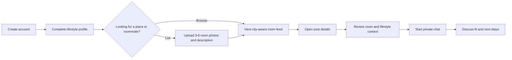
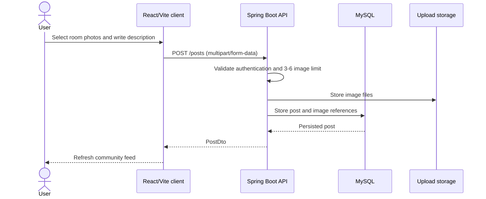
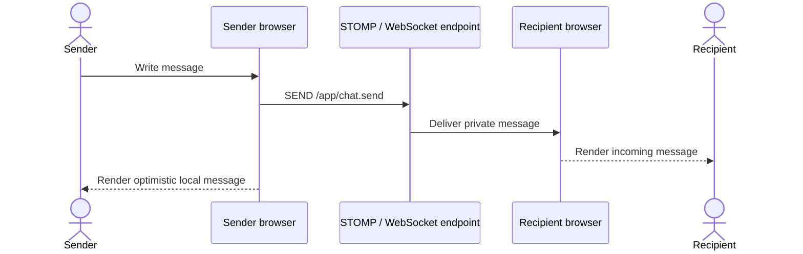
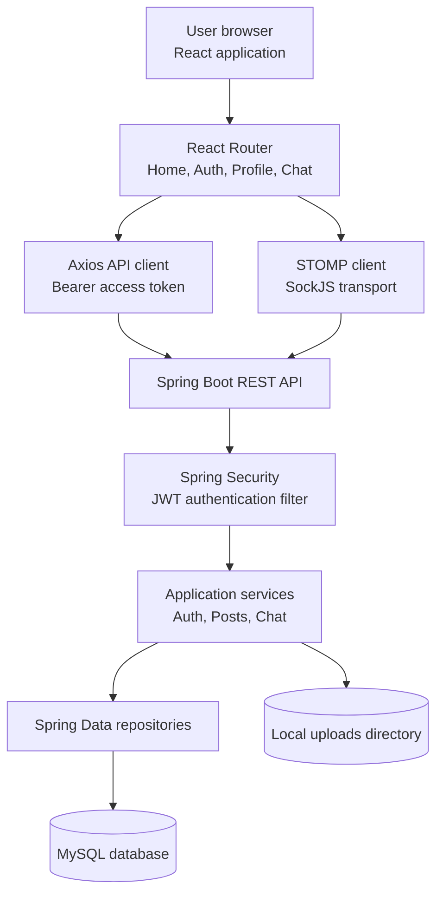
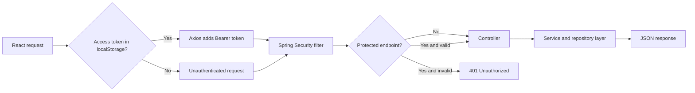
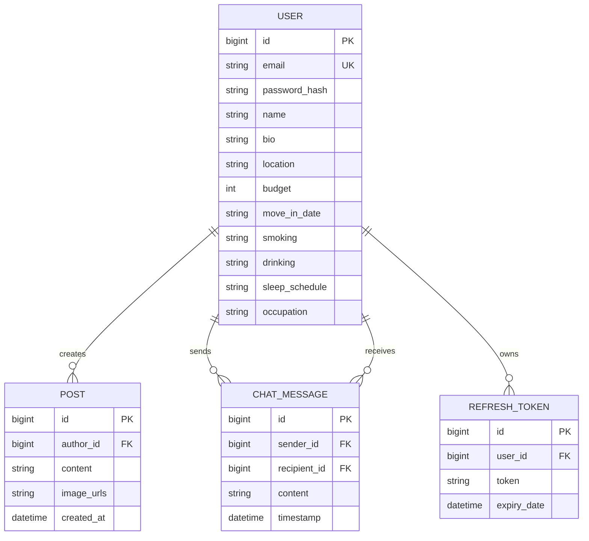
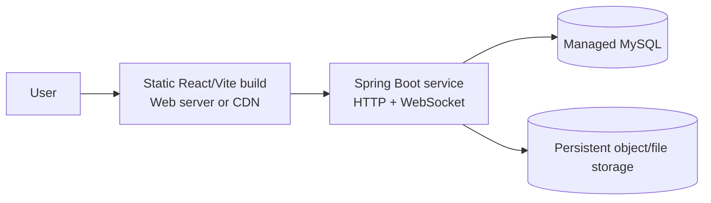

# FindMyRoomie

> **Find a compatible roommate.**
>
> A compatibility-first roommate discovery platform that helps people find not only a place to live, but a person they can live well with.

[](frontend/)
[](backend/)
[](backend/)
[](LICENSE)

FindMyRoomie is an open-source project for developers, designers, and housing communities. Fork it, study it, improve it, and share modified versions under the [MIT License](LICENSE). The FindMyRoomie name, logo, and other branding remain separate from the code license and must not be used to imply official affiliation or endorsement.

Project policies: [Contributing](CONTRIBUTING.md) · [Code of Conduct](CODE_OF_CONDUCT.md) · [Security](SECURITY.md)

## Contents

- [Why FindMyRoomie](#why-findmyroomie)
- [Problem Statement](#problem-statement)
- [Key Features](#key-features)
- [What the Platform Does](#what-the-platform-does)
- [What Makes It Different](#what-makes-it-different)
- [How It Works](#how-it-works)
- [System Design](#system-design)
- [Architecture](#architecture)
- [Technology Stack](#technology-stack)
- [Project Structure](#project-structure)
- [Getting Started](#getting-started)
- [Configuration](#configuration)
- [API Overview](#api-overview)
- [Security and Data Notes](#security-and-data-notes)
- [Roadmap](#roadmap)
- [Contributing](#contributing)
- [License](#license)

## Why FindMyRoomie

People spend a remarkable part of their day at home with the person they live with. A roommate affects sleep, work, privacy, cleanliness, finances, guests, routines, and the emotional feel of home. Yet most housing platforms optimize for the room or property first and leave compatibility to chance.

FindMyRoomie puts the human fit at the center. It gives people a place to describe how they live, discover rooms and potential roommates in their city, understand lifestyle preferences before reaching out, and start a direct conversation before making a commitment.

## Problem Statement

Finding housing is already difficult. Finding a compatible roommate is a separate, under-served problem:

- Property listings reveal space, price, and location, but rarely the habits of the people sharing it.
- Social platforms offer conversations, but not a structured housing context.
- People often discover incompatibilities only after moving in together.
- Important signals such as smoking, drinking, sleep schedule, occupation, budget, and move-in timing are difficult to compare quickly.
- A promising connection can be lost when there is no simple path from discovery to a private conversation.

**FindMyRoomie addresses this gap by combining room discovery, lifestyle context, profile information, and real-time messaging in one focused workflow.**

## Key Features

- JWT-based registration, login, refresh, and logout
- Lifestyle-aware profiles with location, budget, move-in date, occupation, smoking, drinking, sleep schedule, and bio
- Paginated community feed with city-aware results for users who have set a location
- Room posts with descriptions and three to six uploaded images
- Post ownership controls for editing and deleting a user's own posts
- Post detail view with room gallery and author compatibility context
- Real-time STOMP messaging over a SockJS WebSocket endpoint
- React single-page experience with Home, Login, Register, Profile, and Chat routes

## What the Platform Does

### For people looking for a roommate or room

1. Create an account with email, password, and name.
2. Build a lifestyle-aware profile with bio, city, budget, move-in date, occupation, smoking, drinking, and sleep schedule.
3. Browse a community feed of room posts, with location-aware results when a city is set.
4. Open a post to view room photos, the description, and the author's compatibility details.
5. Contact a potential roommate directly through private chat.
6. Update profile information as plans change.

### For people sharing a room or opening a place

1. Sign in and create a room post.
2. Add a description and between three and six room images.
3. Let other users understand both the space and the person behind it.
4. Edit or delete posts they own.
5. Continue the conversation in real time with interested users.

## What Makes It Different

| Traditional housing platforms | FindMyRoomie |
| --- | --- |
| Start with property search | Starts with the living relationship |
| Optimize for listing details | Combines room details with lifestyle context |
| Compatibility is an afterthought | Habits and routines are visible before contact |
| Communication often leaves the platform | Discovery flows directly into private messaging |
| Broad, marketplace-style inventory | A focused community feed with city-aware results |
| Decisions are based mostly on price and location | Decisions can include budget, routine, occupation, and social preferences |

The product is not trying to replace every real-estate marketplace. Its purpose is narrower and more personal: **reduce the uncertainty of choosing the person you will share home with.**

## How It Works

### End-to-end user journey



### Room post workflow



### Real-time chat workflow



## System Design

### Logical architecture



### Request and authentication flow



### Data model



### Deployment view



For the current local implementation, the frontend runs on Vite, the backend runs on Spring Boot, MySQL runs locally, and images are stored in the backend `uploads/` directory. Production deployments should replace local uploads with durable object storage and use managed secrets.

## Technology Stack

| Layer | Technology | Responsibility |
| --- | --- | --- |
| Frontend | React 19, Vite 7 | Single-page user interface and routing |
| Frontend networking | Axios | REST requests and JWT request interceptor |
| Frontend messaging | `@stomp/stompjs`, SockJS | Real-time chat connection |
| Backend | Java 17, Spring Boot 3.4 | REST API and WebSocket message handling |
| Security | Spring Security, JJWT | Authentication, access tokens, refresh tokens |
| Persistence | Spring Data JPA, Hibernate | Domain persistence and repository access |
| Database | MySQL | Users, posts, messages, and refresh tokens |
| Media | Local filesystem | Room image storage in development |

## Project Structure

```text
FindMyRoomie/
├── backend/
│   ├── pom.xml
│   ├── src/main/java/com/findmyroomie/
│   │   ├── config/          # CORS and WebSocket configuration
│   │   ├── controller/      # REST and chat entry points
│   │   ├── dto/             # API-facing data transfer objects
│   │   ├── model/           # JPA entities
│   │   ├── repository/      # Spring Data repositories
│   │   ├── security/        # JWT and Spring Security integration
│   │   └── service/         # Application and domain services
│   ├── src/main/resources/  # Local Spring configuration
│   └── uploads/             # Runtime-generated room images
├── frontend/
│   ├── package.json
│   ├── src/
│   │   ├── api/             # Axios API modules
│   │   ├── components/      # Reusable UI components
│   │   ├── context/         # Authentication state
│   │   └── pages/           # Home, auth, profile, and chat screens
│   └── public/
└── README.md
```

## Getting Started

### Prerequisites

- Java 17 or newer
- Maven 3.9 or newer, or use the Maven wrapper if one is added later
- Node.js 18 or newer and npm
- MySQL 8 or newer
- Git

### 1. Clone the repository

```bash
git clone <your-repository-url>
cd FindMyRoomie
```

### 2. Create the database

```sql
CREATE DATABASE findmyroomie;
```

Create the local backend configuration from the safe template. The working `application.properties` is intentionally ignored by Git because it contains credentials and secrets.

```powershell
Copy-Item backend/src/main/resources/application.properties.example backend/src/main/resources/application.properties
```

Edit the copied file with local MySQL credentials and a long random JWT secret. Never commit it.

### 3. Start the backend

From the repository root:

```bash
cd backend
mvn spring-boot:run
```

The API starts at `http://localhost:8080`.

### 4. Configure and start the frontend

Create `frontend/.env`:

```env
VITE_API_BASE=http://localhost:8080
```

Then start the development server:

```bash
cd frontend
npm install
npm run dev
```

Open `http://localhost:5173` in your browser.

### Available frontend commands

```bash
npm run dev       # Start Vite development server
npm run build     # Create a production build
npm run lint      # Run ESLint
npm run preview   # Preview the production build locally
```

### First-use checklist

1. Register a user.
2. Add a city and lifestyle details in Profile.
3. Create a post with three to six room images.
4. Browse the feed and open a post.
5. Select a user and send a chat message.

## Configuration

| Setting | Example | Purpose |
| --- | --- | --- |
| `VITE_API_BASE` | `http://localhost:8080` | Frontend REST API base URL |
| `server.port` | `8080` | Backend HTTP port |
| `spring.datasource.url` | `jdbc:mysql://localhost:3306/findmyroomie` | MySQL connection URL |
| `spring.datasource.username` | `root` | Database user |
| `spring.datasource.password` | local secret | Database password |
| `jwt.secret` | random secret | Signs access tokens |
| `app.cors.allowed-origins` | `http://localhost:5173` | Permitted frontend origin |

Do not commit `.env`, production credentials, JWT secrets, database dumps, `target/`, `node_modules/`, `dist/`, or runtime uploads.

## API Overview

All paths below are relative to `http://localhost:8080`.

### Authentication

| Method | Endpoint | Description |
| --- | --- | --- |
| `POST` | `/auth/register` | Create an account and receive access and refresh tokens |
| `POST` | `/auth/login` | Authenticate an existing user |
| `POST` | `/auth/refresh` | Exchange a valid refresh token for an access token |
| `POST` | `/auth/logout` | Invalidate refresh tokens for a user |

### Users

| Method | Endpoint | Description |
| --- | --- | --- |
| `GET` | `/users` | List community users |
| `GET` | `/users/me` | Get the authenticated user's profile |
| `PUT` | `/users/me` | Update the authenticated user's profile |
| `GET` | `/users/{id}` | Get a user's public profile |

### Posts and media

| Method | Endpoint | Description |
| --- | --- | --- |
| `GET` | `/posts?page=0&size=10` | Get a paginated post feed; authenticated users receive city-aware results |
| `POST` | `/posts` | Create a post with `content` and 3–6 image files |
| `PUT` | `/posts/{id}` | Edit a post owned by the authenticated user |
| `DELETE` | `/posts/{id}` | Delete a post owned by the authenticated user |
| `GET` | `/posts/uploads/{fileName}` | Serve an uploaded room image |

### Real-time messaging

| Item | Value |
| --- | --- |
| SockJS endpoint | `/ws` |
| Application prefix | `/app` |
| Send destination | `/app/chat.send` |
| Broker destinations | `/topic`, `/queue` |
| User destination prefix | `/user` |

## Security

- Passwords are handled by the backend authentication service and should never be sent to the frontend after authentication.
- Access tokens are attached to REST requests through the Axios interceptor.
- Protected post mutations and profile updates require authentication.
- Post edits and deletes are restricted to the post owner.
- Uploaded filenames are normalized before being resolved by the image endpoint.
- Local configuration and runtime files are excluded through the frontend and backend `.gitignore` files.
- Before publishing a repository, rotate any credentials that may have existed in tracked files or Git history. Removing a file from the working tree alone does not remove it from commit history.

See [SECURITY.md](SECURITY.md) for vulnerability reporting and contributor security expectations.

For production, add HTTPS, secure token storage, rate limiting, stronger upload validation, centralized logging, persistent object storage, database migrations, and a managed secret store.

## Roadmap

- Compatibility scoring and explainable recommendations
- Search and filters for budget, city, move-in date, and lifestyle preferences
- Conversation history persisted and paginated
- Email verification and password reset
- Report, block, and moderation workflows
- Image moderation and virus scanning
- Map-based discovery and neighborhood information
- Production deployment with managed MySQL and object storage
- Automated tests across frontend, API, and WebSocket workflows

## Contributing

Please read [CONTRIBUTING.md](CONTRIBUTING.md) for the complete fork, setup, testing, commit, and pull request workflow. All participants are expected to follow the [Code of Conduct](CODE_OF_CONDUCT.md).

## License

The source code is licensed under the [MIT License](LICENSE). This permissive license allows use, modification, distribution, and sublicensing, subject to its terms.

The MIT License does not grant permission to use FindMyRoomie trademarks, logo, name, or branding to imply official affiliation or endorsement.

---

**FindMyRoomie is built around a simple idea: a home is more than a listing, and compatibility is more than a filter.**
